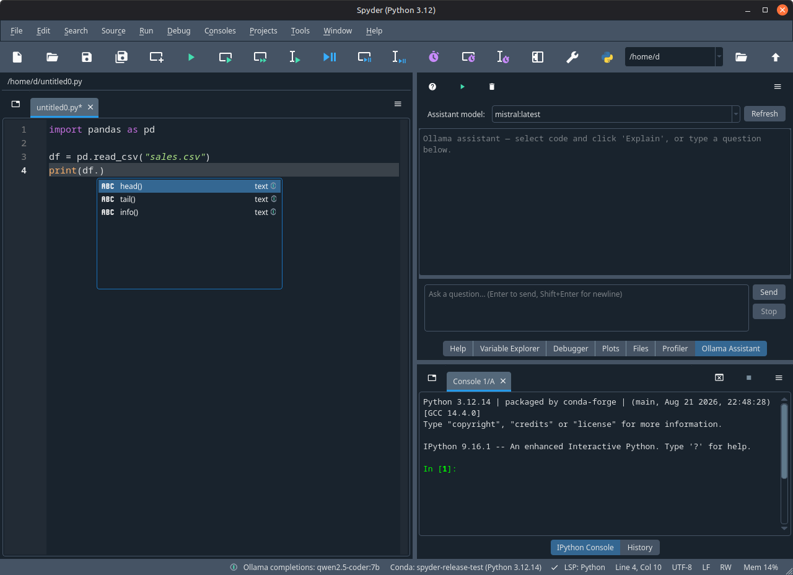
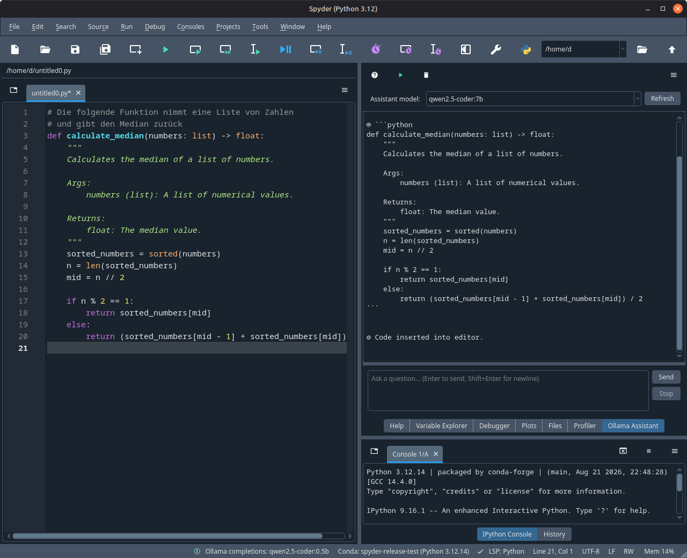

# spyder-ollama

Local AI code completion and assistant for [Spyder 6+](https://www.spyder-ide.org/) via [Ollama](https://ollama.com/).

Three features in one package — all running against your local Ollama instance. No API keys, no cloud, fully private.

1. **Inline completions** — context-aware suggestions as you type
2. **Ollama Assistant panel** — explain selected code, ask questions, streaming answers
3. **Generate code from comments** — write a comment describing a function, get the implementation inserted below it





## Requirements

- **Spyder** ≥ 6.0
- **Ollama** running locally or on your network (default: `http://localhost:11434`)
- A code-capable model, e.g.:
  ```bash
  ollama pull qwen2.5-coder:1.5b
  ```
  (You can also pull models later from inside Spyder — see below.)

## Installation

The plugin must be installed **into the same environment that runs Spyder**.

Recommended: a fresh conda environment with Spyder and the plugin together:

```bash
conda create -n spyder-ollama -c conda-forge python=3.12 spyder
conda activate spyder-ollama
pip install git+https://github.com/IfaDW/spyder-ollama.git
spyder
```

If you already run Spyder from an existing conda environment, activate that environment and run only the `pip install` line.

Note: standalone Spyder installers ship their own internal environment —
installing the plugin there is not covered by this guide; use a conda-based Spyder as shown above.

## Inline Completions

Suggestions appear automatically while typing (e.g. after `df.`), or on demand via **Ctrl+Space** — useful after pasting code or clicking into a line.

Configure via the **Ollama** status bar widget → **Configure Ollama provider**:

| Setting | Default | Description |
|---|---|---|
| Ollama URL | `http://localhost:11434` | Base URL of your Ollama instance |
| Model | `qwen2.5-coder:1.5b` | Completion model (dropdown lists your local models) |
| Pull model | — | Type any model name from [ollama.com/library](https://ollama.com/library) and pull it with live progress, directly from the dialog |
| Suggestions | 3 | Number of completions (1–10) |
| Temperature | 0.2 | Lower = more deterministic |
| Context before/after cursor | 50 / 10 lines | Code window sent around the cursor |

Small, fast models (1.5B–3B coder models) work best here — completion is about latency.

## Ollama Assistant Panel

Open via **View → Panes → Ollama Assistant**. The panel has its **own model selector** at the top — pick a larger model here than for completions if your hardware allows.

**Explain code:** Select code in the editor → **Explain Selection** in the panel toolbar. The explanation streams into the panel.

**Ask questions:** Type into the input field, press **Enter** to send (**Shift+Enter** for a newline).

**Generate code from a comment:** Write a comment describing what you want:

```python
# The following function takes a text and scores its sentiment
# as a value between 0 (negative) and 1 (positive)
```

Place the cursor on the comment (multi-line comment blocks are picked up automatically, or select text explicitly) → **Generate Code from Comment**. The model streams its output into the panel; the extracted code is syntax-checked and — only if valid — inserted below the comment. Invalid output stays in the panel with an explanation instead of landing in your editor.

**Stop** interrupts any running generation.

## How it works

**Completions:** The plugin extracts a code window around your exact cursor position (line and column), inserts a `<|CURSOR|>` marker, and queries Ollama with `format="json"` for structured suggestions.

**Assistant:** Requests run with task-specific system prompts and stream token by token in a background thread — Spyder never blocks.

**Code generation:** Responses are cleaned (markdown fences and surrounding prose are stripped) and validated with a Python syntax check before insertion.

## Tips

- Completions and chat can use different models. On a 12 GB GPU, a 14B coder model for the assistant plus a 1.5B model for completions is a good split — note that Ollama may swap models in and out of VRAM when both are used alternately.
- If Ollama runs on another machine (e.g. a homelab container), just change the base URL in the provider settings.

## Origin

This project started as a fork of [spyder-ide/langchain-provider](https://github.com/spyder-ide/langchain-provider) by the Spyder Project Contributors (MIT) and has since been substantially rewritten: Ollama-native, no OpenAI dependency, new assistant panel, code generation, model management. See [NOTICE](NOTICE).

This project is not affiliated with or endorsed by Ollama.

## License

[MIT](LICENSE)
